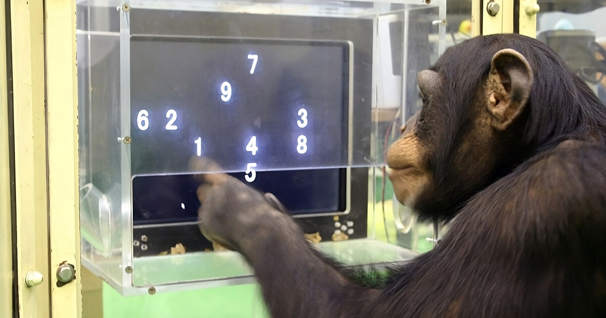
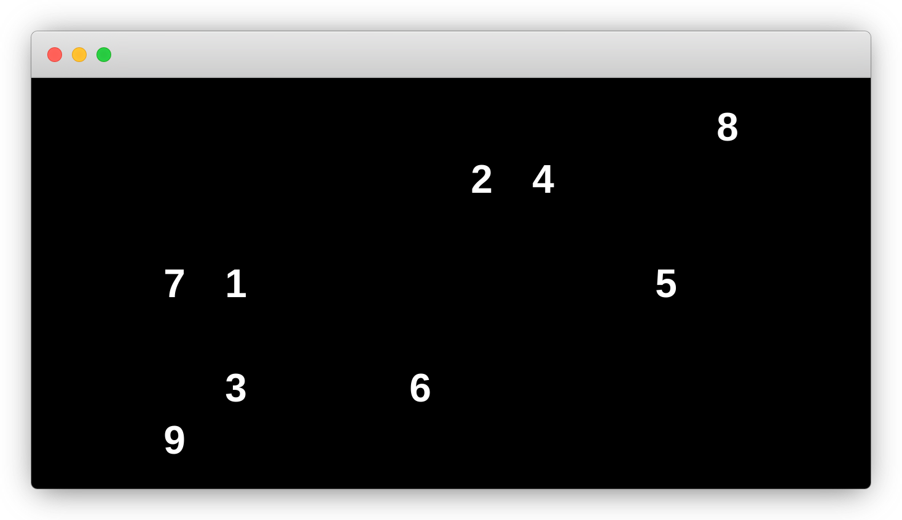
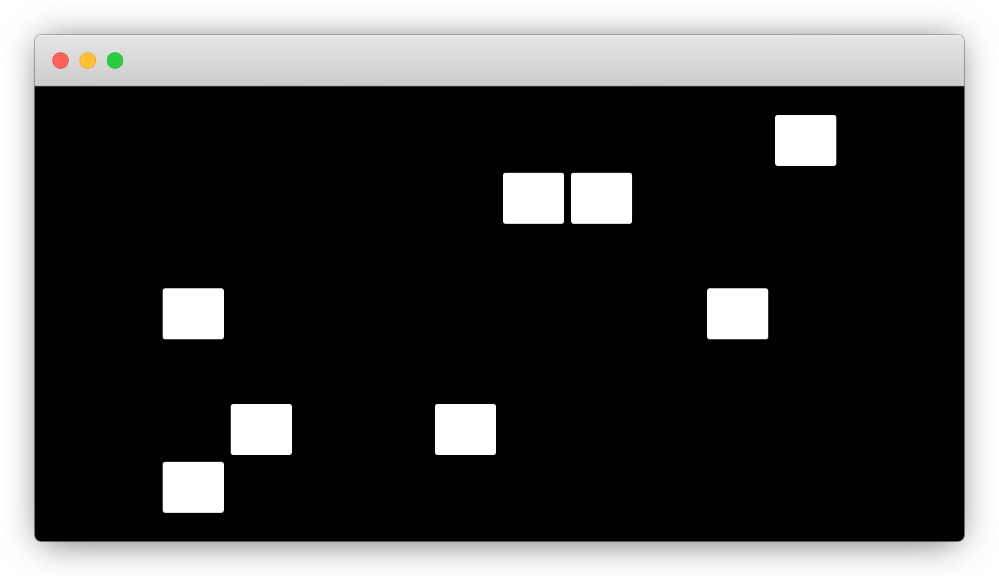

## Sobre
#### Reprodução do teste de memória realizado por [Tetsuro Matsuzawa](https://en.wikipedia.org/wiki/Tetsuro_Matsuzawa) com chimpanzés.

## Como funciona
Você verá uma série de números em posições aleatórias e deverá clicar neles em ordem crescente. 
O desafio é que, assim que você clicar no número 1, os números subsequentes serão escondidos. 
Seu objetivo é lembrar a ordem exata em que os números foram exibidos e clicá-los na sequência correta. 
O teste suporta uma sequência de até 70 números, sendo que a primeira sequência inicia com 2 números. 
A quantidade de números é ajustada de acordo com o seu progresso no teste.

## Screenshots

## Licença
Distribuído sob a licença [GPLv3](./LICENSE). 
- Ícone feito por [smashingstocks - Flaticon](https://www.flaticon.com/authors/smashingstocks)